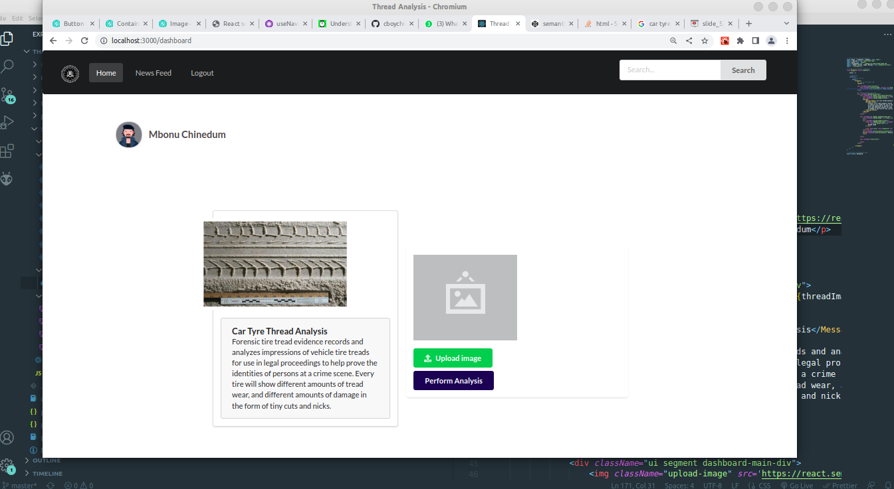

# FBI CAR TYRE THREAD ANALYSIS


<a class="center">

</a>

<p align="center"></p>

<p align="center"></p>

<p align="center"></p>

<p>
Forensic tire tread evidence records and analyzes impressions of vehicle tire treads for use in legal proceedings to help prove the identities of persons at a crime scene. Every tire will show different amounts of tread wear, and different amounts of damage in the form of tiny cuts and nicks.
</p>


### Description
#### What are TYRE marks in forensic science?

<p>
The tyre marks are also like footprints, either two-dimensional prints or three-dimensional impressions depending upon the surface on which they are present. Skid marks are the marks left by wheels of motor vehicles, which are no longer rotating. <br> 

This repository contains the code for analyzing the tread pattern of car tyres using image embeddings. The aim of this analysis is to identify the unique features of different types of tyres and determine which ones are better suited for different driving conditions.
</p>


### Data 

<p> 
The dataset used in this analysis consists of images of car tyre treads. The images are collected from different sources and include various brands and types of tyres. Each image is labeled with the corresponding tyre type and brand.
</p> 


### Support Vector Machines (SVM) 

<p> 
Support Vector Machines (SVM) is a supervised machine learning algorithm that can be used for classification and regression analysis. SVM is particularly useful for classification problems in which the data points are not linearly separable. <br> 

SVM works by finding the optimal hyperplane that maximizes the margin between the two classes in the data. The hyperplane is defined as the decision boundary that separates the two classes. The margin is the distance between the hyperplane and the nearest data point from each class. <br> 

In SVM, the data points that lie closest to the hyperplane are known as support vectors. These vectors are used to define the hyperplane and are important in determining the decision boundary. <br> 

SVM has several advantages over other classification algorithms. It can handle high-dimensional data, is effective in cases where the number of features is greater than the number of samples, and has a roubust performance on small datasets. <br> 

However, SVM can be sensitive to the choice of kernel function and the regularization parameter. It can also be computationally intensive, especially for large datasets. <br> 

Overall, SVM is a powerfull machine learning algorithm that can be used for a wide range of classification problems. It is a valuable tool for data scientists and machine learning practitioners to have in ther toolbox. 

</p>


### Problem Statement

<p>
The analysis is carried out in two stages. In the first stage, we use a pre-trained convolutional neural network to generate image embeddings for each tyre tread image. The embeddings are vectors that capture the unique features of the tyre tread. In the second stage, we use the embeddings to train a classification model that can predict the tyre type based on the tread pattern.
</p>

### Requirements 

<p> 
The following Python packages are required to run the code in this repository:

<ul>
<li> tensorflow </li>
<li> keras </li>
<li> numpy </li>
<li> pandas </li>
<li> matplotlib </li> 
</ul>
</p>


### Working Principle

<p>

</p>


### Installation
<p>

</p>


### Running the application
<p>

</p>


### Machine learning classifier used.
<p>
  SVM
</p>


### Important HTTP STATUS CODE
<p>
Here's a list of some of the most common HTTP status codes, along with their meanings and functions:
<ul>
<li> <b> 1xx Informational codes: </b> </li>
These codes indicate that the request has been received and is being processed. Some common examples include: <br>

100 Continue: The server has received the request headers and is waiting for the client to send the request body.
101 Switching Protocols: The server is switching to a different protocol (e.g. from HTTP to WebSocket).


<li> <b> 2xx Success codes: </b> </li>
These codes indicate that the request was successful. Some common examples include: <br>

** 200 OK: The request was successful, and the server is returning the requested data.

** 201 Created: The request was successful, and a new resource was created on the server.

** 204 No Content: The request was successful, but there is no data to return.


<li> <b> 3xx Redirection codes: </b> </li>
These codes indicate that the client needs to take additional action to complete the request. Some common examples include: <br>

** 301 Moved Permanently: The requested resource has been permanently moved to a new location.

** 302 Found: The requested resource has been temporarily moved to a different location.

** 304 Not Modified: The client's cached copy of the resource is still valid, so the server is not returning a new copy.


<li> <b> 4xx Client error codes: </b> </li>
These codes indicate that there was an error on the client's side of the request. Some common examples include: <br>

** 400 Bad Request: The request was malformed or invalid.

** 401 Unauthorized: The client needs to provide authentication credentials to access the requested resource.

** 404 Not Found: The requested resource could not be found on the server.


<li> <b> 5xx Server error codes: </b> </li>
These codes indicate that there was an error on the server side of the request. Some common examples include:

** 500 Internal Server Error: An unexpected error occurred on the server.

** 503 Service Unavailable: The server is temporarily unable to handle the request.

** There are many other HTTP status codes beyond these examples, but these are some of the most commonly used.

</ul>

</p>


### Bugs
### Ubuntu 22.04 Bugs

<p>
Check the bug report here: <a href="https://bugs.launchpad.net/ubuntu/+source/chromium-browser/+bug/1970148"> link </a>

As proposed by <b> Olivier Tilloy</b> in the bug report, the command
</p>

```bash
 $ sudo apt install xdg-desktop-portal-gnome

```

<p>
solved my problem.

I am using Ubuntu 22.04 on Xorg with Nvidia card.

</p>


### Results

<p> 
The results of the analysis are presented in the form of a confusion matrix and classification report. The classification report includes precision, recall, and F1-score for each class.
</p> 

### Conclusion

<p> 
The analysis shows that the tread pattern of car tyres contains unique features that can be captured using image embeddings. These embeddings can be used to train a classification model that can accurately predict the tyre type based on the tread pattern. This analysis can be used to inform tyre purchasing decisions and improve the safety and performance of vehicles on the road.
</p>
