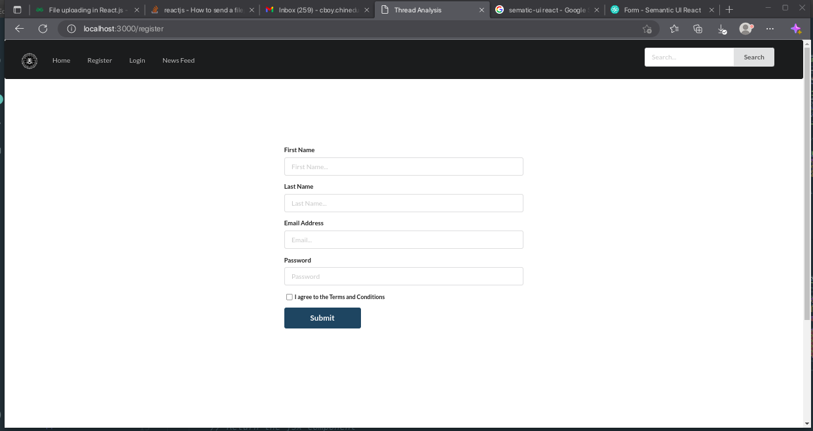

# FBI CAR TYRE THREAD ANALYSIS


<a class="center">

</a>

<p align="center">

<h3> Login Page </h3> 
This repository contains a login page that can be used for authentication in web applications. The login page is built using HTML, CSS, and JavaScript. <br> 

<h4> Features </h4> 
The login page has the following features: <br> 
<ul> 
<li> User authentication: User can enter their username and password to login into the web application. <li>  
<li> Password reset: Users can reset their password by clicking on the "Forgot Password" link and entering their email address. </li> 
<li> Remember me: Users can choose to have their login credentials remembered on the device they are using. </li>
<li> Input validation: The login page validates user input to ensure that the correct information is entered. </li>
</ul>

<h4> Security </h4> 
The login page uses secure password storage techniques to ensure that user passwords are protected. Passwords are hashed using a one-way hash function and salted to prevent brute-force attacks. 
</p>


<p align="center">
<h4> Register Page </h4> 
The register page allows users to create an account for the car tyre thread analysis web application. Users can enter their name, email address, and password to register for the service. The page also includes input validation to ensure that the correct information is entered.</p>


<p align="center">

<h4> Dashboard Page </h4> 

The dashboard page provides users with an overview of their car tyre thread analysis data. The page includes charts and graphs that visualize data such as tyre thread depth, tyre pressure, and tyre wear patterns. Users can interact with the charts to view detailed information about specific data points.

<br> 

The dashboard page also includes a navigation menu that allows users to view different aspects of their car tyre thread analysis data, such as historical trends and comparison charts.
</p>

<p>
Forensic tire tread evidence records and analyzes impressions of vehicle tire treads for use in legal proceedings to help prove the identities of persons at a crime scene. Every tire will show different amounts of tread wear, and different amounts of damage in the form of tiny cuts and nicks.
</p>


### Description
#### What are TYRE marks in forensic science?

<p>
The tyre marks are also like footprints, either two-dimensional prints or three-dimensional impressions depending upon the surface on which they are present. Skid marks are the marks left by wheels of motor vehicles, which are no longer rotating. <br> 

This repository contains the code for analyzing the tread pattern of car tyres using image embeddings. The aim of this analysis is to identify the unique features of different types of tyres and determine which ones are better suited for different driving conditions.
</p>


### Data 

<p> 
The dataset used in this analysis consists of images of car tyre treads. The images are collected from different sources and include various brands and types of tyres. Each image is labeled with the corresponding tyre type and brand.
</p> 


### Support Vector Machines (SVM) 

<p> 
Support Vector Machines (SVM) is a supervised machine learning algorithm that can be used for classification and regression analysis. SVM is particularly useful for classification problems in which the data points are not linearly separable. <br> 

SVM works by finding the optimal hyperplane that maximizes the margin between the two classes in the data. The hyperplane is defined as the decision boundary that separates the two classes. The margin is the distance between the hyperplane and the nearest data point from each class. <br> 

```python
  from sklearn import datasets
  from sklearn.model_selection import train_test_split
  from sklearn.svm import SVC
  from sklearn.metrics import accuracy_score

  # Load the iris dataset
  iris = datasets.load_iris()

  # Split the dataset into training and testing sets
  X_train, X_test, y_train, y_test = train_test_split(iris.data, iris.target, test_size=0.3, random_state=42)

  # Create an SVM classifier object
  svm_classifier = SVC(kernel='linear', C=1)

  # Fit the SVM classifier to the training data
  svm_classifier.fit(X_train, y_train)

  # Predict the classes of the test data using the trained SVM classifier
  y_pred = svm_classifier.predict(X_test)

  # Calculate the accuracy of the SVM classifier on the test data
  accuracy = accuracy_score(y_test, y_pred)

  # Print the accuracy of the SVM classifier
  print('Accuracy:', accuracy)

```

In SVM, the data points that lie closest to the hyperplane are known as support vectors. These vectors are used to define the hyperplane and are important in determining the decision boundary. <br> 

SVM has several advantages over other classification algorithms. It can handle high-dimensional data, is effective in cases where the number of features is greater than the number of samples, and has a roubust performance on small datasets. <br> 

However, SVM can be sensitive to the choice of kernel function and the regularization parameter. It can also be computationally intensive, especially for large datasets. <br> 

Overall, SVM is a powerfull machine learning algorithm that can be used for a wide range of classification problems. It is a valuable tool for data scientists and machine learning practitioners to have in ther toolbox. 

</p>


### Problem Statement

<p>
The analysis is carried out in two stages. In the first stage, we use a pre-trained convolutional neural network to generate image embeddings for each tyre tread image. The embeddings are vectors that capture the unique features of the tyre tread. In the second stage, we use the embeddings to train a classification model that can predict the tyre type based on the tread pattern.
</p>

### Requirements 

<p> 
The following Python packages are required to run the code in this repository:

<ul>
<li> tensorflow </li>
<li> sklearn </li>
<li> keras </li>
<li> numpy </li>
<li> pandas </li>
<li> matplotlib </li> 
</ul>
</p>


### Installation
<p>
  Extract the node_modules.tar archive, by typing the following command below 
</p>

```bash 
  $ tar -xf node_modules.tar 
```
<p>
Clone the repo from the link, then change directory into the 
FBI-Car-Tyre-Thread Analysis folder. <br> 

Then execute the following code below 
</p>

```bash 
  $ npm install .  
  $ sudo npm install nodemon -g 
  $ sudo npm install pm2 -g 
```


### Running the main REACT application
<p>
Inside the working directory, open an command prompt, and type the following commands below 
</p>

```bash 
  $ npm start 
```

<p> 
 This would start the server on <a> localhost:3000 </a>
</p>

<br> 

### Running the AUTH server 
<p>
Inside the project working directory, change directory using the command prompt into the <b> "backend-server"</b> directory, and type the following commands.  
</p>

```bash 
  $ cd 'backend-server'
  $ npm start  
```

<p> Or </p> 

```bash 
  $ cd 'backend-server' 
  $ nodemon app.js 
```

### Running the Machine Learning Server 
<p>

</p>


### Bugs
### Ubuntu 22.04 Bugs

<p>
Check the bug report here: <a href="https://bugs.launchpad.net/ubuntu/+source/chromium-browser/+bug/1970148"> link </a>

As proposed by <b> Olivier Tilloy</b> in the bug report, the command
</p>

```bash
 $ sudo apt install xdg-desktop-portal-gnome

```

<p>
solved my problem.

I am using Ubuntu 22.04 on Xorg with Nvidia card.

</p>


### Results

<p> 
The results of the analysis are presented in the form of a confusion matrix and classification report. The classification report includes precision, recall, and F1-score for each class.
</p> 

### Conclusion

<p> 
The analysis shows that the tread pattern of car tyres contains unique features that can be captured using image embeddings. These embeddings can be used to train a classification model that can accurately predict the tyre type based on the tread pattern. This analysis can be used to inform tyre purchasing decisions and improve the safety and performance of vehicles on the road.
</p>
